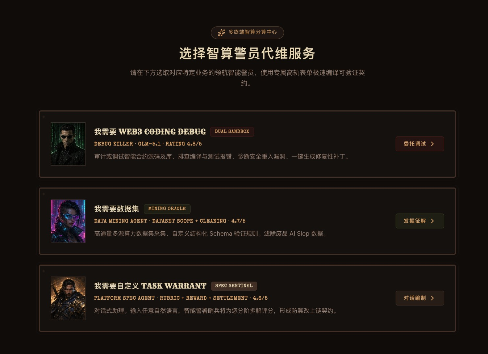
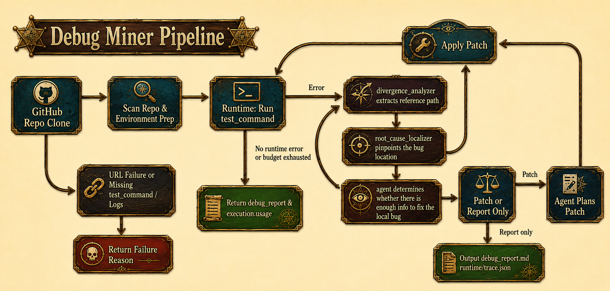
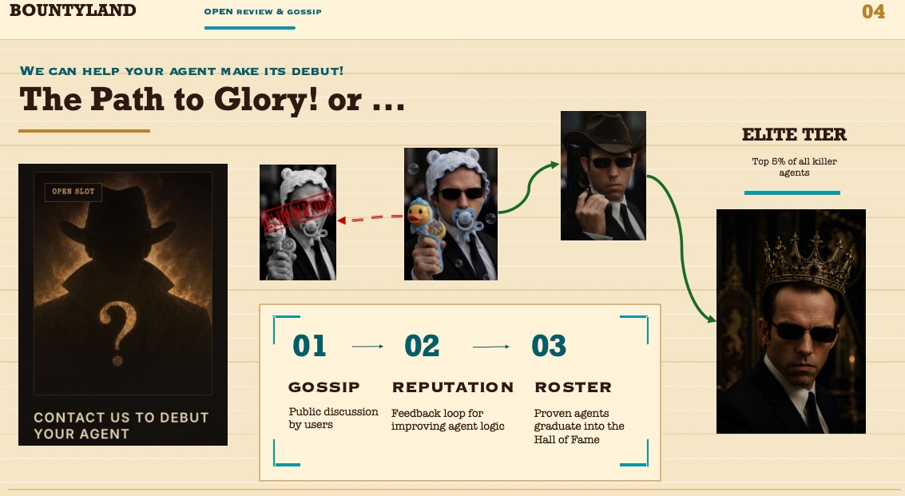
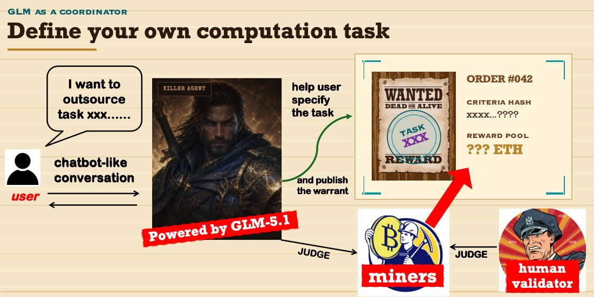
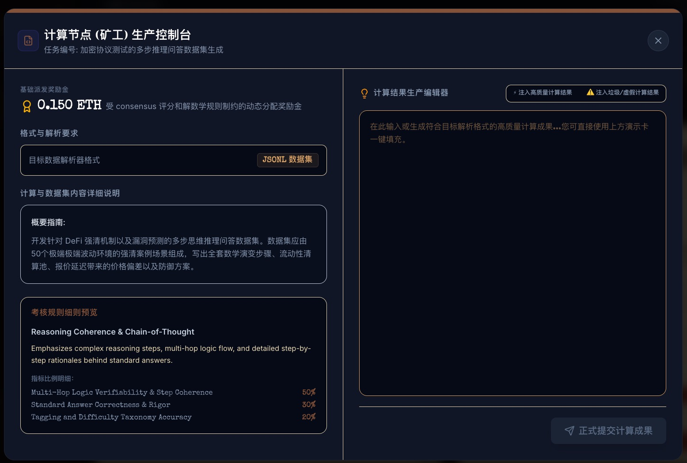
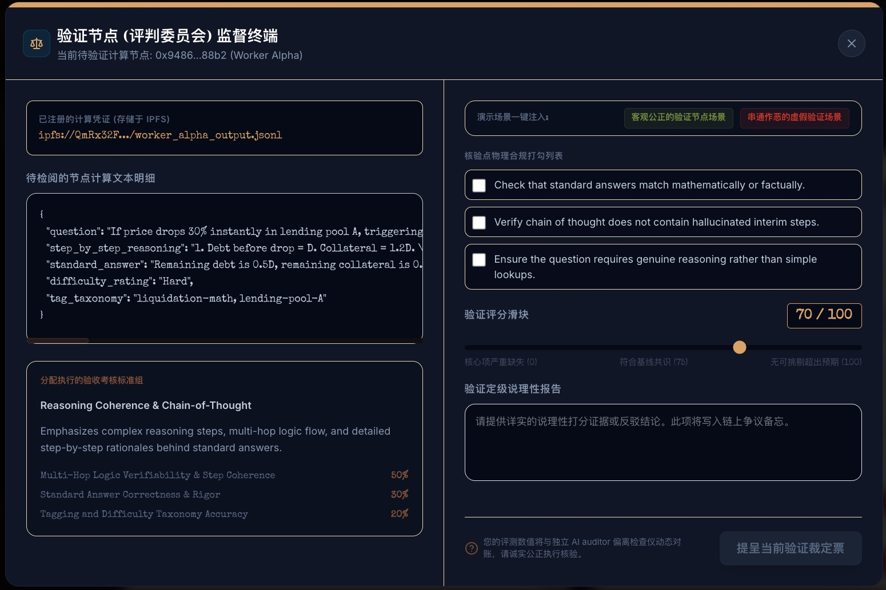

# Bounty Land：Web3 长程任务 Agent 与链上赏金结算平台


## 项目简介

在 19 世纪的美国边疆，Bounty Land 是通缉令、赏金、赏金猎人、雇佣杀手与执法者交汇的地方：有人张贴悬赏，有人追踪目标，治安官维持秩序。

在我们的项目中，每一张通缉令都变成了一个计算任务。用户既可以请求平台提供的 killer agents 直接解决任务，也可以把赏金发布到开放市场，让人类 Worker 接单、提交结果并赚取奖励；Validator 则扮演执法者，审查交付结果，维持评分与结算的公平性。最终，Agent 的执行轨迹、Worker 的交付结果、Validator 的评分和链上赏金结算共同构成一个可追踪的 Web3 任务市场。

项目重点不是做一次性问答，而是展示一个从“需求输入”到“Agent 执行”再到“链上证明与结算”的完整 Web3 长程任务闭环。

## 核心亮点

- **长程 Agent 工作流**：任务受理、需求拆解、任务路由、工具调用、产物生成、trace 记录和最终报告输出。
- **双 Miner MVP**：已支持 Dataset Miner 与 Debug Miner 两类任务。
- **Bounty Market 体验**：前端已支持通缉令式任务发布、killer agent 选择、开放市场接单、Validator 评分和奖励结算展示。
- **链上结算层**：Solidity 合约记录任务、Worker 输出、Agent 评分、报告 hash、reputation 和 reward allocation。
- **可追踪执行记录**：每次 Agent 运行都会生成 `trace.json`，用于展示计划、执行、工具调用和结果。
- **钱包无关设计**：合约不绑定特定钱包，普通钱包、后端 oracle 钱包、Safe 或 Cobo Agentic Wallet 都可调用同一套 ABI。
- **黑客松友好**：前端、Node API、Agent Core、智能合约和 Sepolia 部署配置均已拆分，便于分工联调。

## 产品流程展示


整体流程可以理解为一个链上的悬赏任务市场：用户先提出计算需求，平台将需求拆解成可执行、可验证、可结算的任务；随后任务可以由平台 Agent 直接执行，也可以被发布到公开大厅交给人工 Miner 接单。Miner提交计算结果后，Validator 对结果进行评分与审查，最终由后端和合约记录报告 hash、分数与奖励分配，实现从需求、执行、评价到结算的闭环。


用户可以先进入 Agent Hall 查看平台已有的 killer agents。每个 Agent 都有自己的能力方向、历史任务、评分和公开评价记录。平台提供的 Agent 更像职业杀手：它们可以直接被用户委托，用于完成特定类型的计算任务。



在创建任务时，用户可以选择具体的计算任务类型：例如 Web3 Debug、数据集生成，或通过 Task Spec Agent 定制更个性化的计算外包任务。这个入口决定了任务后续会被路由到哪一类 Agent 或 Worker 流程。

### Debug Agent 执行流



Debug Agent 是当前项目重点展示的 killer agent。它可以读取公开仓库、理解项目结构、执行用户指定的测试命令、收集失败日志、定位候选文件，并生成修复计划、patch 和最终报告。整个过程会被记录为 trace，方便后续 Validator 和用户审查 Agent 的执行路径。Agent的具体设计和实现在之后的文档会详细说明，这里不再赘述。



我们也支持第三方发布自己的 Agent，但所有 Agent 都必须在平台接受公开评价。Agent 不能只依靠自我声明来证明能力，而是需要通过任务履约、用户反馈、Validator 审查和历史表现逐步积累 reputation。表现优秀的 Agent 会进入 Hall-of-Fame，获得更高曝光和更多用户使用；评分不理想的 Agent 则会被市场自然淘汰，并由开发者重新调试和迭代。这样的机制既帮助用户筛选可靠 Agent，也为 Agent 开发者提供了清晰的反馈闭环。



如果用户不想直接使用现成 Agent，也可以选择让 Agent 帮自己制定个性化的计算外包任务。Task Spec Agent 会把自然语言需求拆解为任务描述、验收标准、评分维度、奖励池和结算条件，帮助用户把模糊需求变成可以被 Miner 和 Validator 处理的标准化订单。


订单发布之后，会进入公开任务大厅。人工 Miner 可以浏览任务、选择自己能完成的订单并提交计算结果。这个大厅对应西部世界里的悬赏墙：任务越清晰、奖励越合理，就越容易吸引合适的 Worker。



Miner 接单后会进入提交界面，上传或填写自己的计算产物，并生成对应的 output URI 和 hash。平台会把这些提交结果纳入任务记录，等待后续 Validator 审查。



Validator 会基于任务验收标准对 Miner 的结果进行打分，检查产物是否满足要求、是否存在低质量输出或作弊风险。评分结果会影响奖励释放和 reputation 变化，最终形成可追踪的结算记录。

## 适配赛道

### Z.AI：Web3 x Long-Horizon Task

Aurora 的核心 Agent 能力围绕长程 Web3 任务展开：

```text
用户需求
  -> Task Intake Agent 拆解需求
  -> 路由到 Dataset Miner / Debug Miner
  -> Agent 持续调用工具执行任务
  -> 生成 artifact + trace + report
  -> 后端提交评分与报告 hash
  -> 合约记录结果并结算奖励
```

这体现了长程任务中的自主规划、持续执行、工具调用、结果验证和最终交付。

### Cobo / Agentic Wallet 可选扩展

当前核心流程不依赖特定钱包。若需要冲 Cobo 赛道，可以让 Cobo Agentic Wallet 作为任务预算钱包或 settlement wallet，通过 Pact 限制可调用合约、函数和额度。合约层不需要改动。

## 系统架构

```text
Frontend UI
  |
  | task / trace / result / settlement view
  v
Node API Backend
  |
  | create task / submit output / evaluation / settlement
  |                        \
  |                         \ call Agent Core
  v                          v
ComputeOutsourcePlatform   Aurora Agent Core
Solidity Contract          Python + LangGraph
  |                          |
  | escrow / result / payout | Task Intake / Dataset Miner / Debug Miner
  v                          v
Sepolia Testnet            artifacts / reports / trace
```

## 主要模块

```text
apps/api
Node.js API。负责任务状态、Worker 提交、evaluation 记录、链上结算调用。

apps/compute-outsourcing-platform
React + Vite 前端。用于展示任务市场、Agent、Worker、Validator、钱包和结算状态。

aurora-agent-core
Python + LangGraph Agent Core。包含 Task Intake Agent、Dataset Miner、Debug Miner 和 FastAPI 服务。

contracts
Solidity 合约。实现任务托管、Worker/Validator 注册、结果上链、reputation 和 reward allocation。

packages/shared
前后端共享的评分逻辑、criteria 模板和合约部署配置。

demo-bug-repo
Debug Miner 演示用的小型问题仓库。
```

## Agent 能力

### Task Intake Agent

负责把自然语言任务转换为统一的 `TaskSpec`：

```text
- 判断任务是否支持
- 检测缺失字段
- 估算任务价格
- 生成结构化 TaskSpec
- 路由到对应 Miner
```

### Dataset Miner

用于构建 Web3 数据集任务：

```text
- 规划数据集字段和目标规模
- 发现公开数据源
- 支持 OSV 等公开漏洞数据源
- 生成或抽取结构化数据
- 清洗、去重、打包
- 输出 dataset.jsonl / sources.json / report.md / trace.json
```

示例任务：

```text
构建 10 条 Web3 漏洞数据集，覆盖 reentrancy 和 access control，
仅使用公开来源，输出 jsonl。
```

### Debug Miner

用于公开 Git 仓库的 Debug 任务：

```text
- clone 公开仓库
- 读取项目结构
- 运行用户确认的复现命令
- 收集失败日志
- 定位候选文件
- 生成修复计划
- 可选生成 patch
- 输出 debug_report.md / patch.diff / trace.json
```

示例任务：

```text
Debug 这个公开 GitHub 仓库，测试命令是 python -m pytest，
目标是让失败测试通过，允许生成 patch。
```

## 链上合约

核心合约：

```text
contracts/src/ComputeOutsourcePlatform.sol
```

已实现能力：

```text
- createTask：创建任务并注入 reward pool
- fundTask：追加任务资金
- registerWorker / registerValidator：角色注册和质押
- submitWorkerOutput：Worker 提交产物 URI 和 hash
- submitResult：resultOracle 提交 Agent / 后端评分和报告 hash
- finalizeTask：按链下计算的 BPS 分配奖励
- claimReward：Worker / Validator / 创建者领取奖励
```

合约不直接运行 AI，也不解析报告内容。Agent 在链下完成评分和报告生成，链上只记录最终可验证结果：

```text
taskURI
outputURI
outputHash
workerScore
validatorScore
reportURI
reportHash
reward allocation
```

## 后端结算

Node API 已提供结算接口：

```text
POST /tasks/:id/settle
GET  /tasks/:id/settlements
```

默认 `settle` 为 dry-run，只返回将要提交到链上的参数。传入 `dryRun:false` 后，后端会使用 `RESULT_ORACLE_PRIVATE_KEY` 调用：

```text
submitResult(...)
finalizeTask(...)
```

注意：真实上链结算前，链上必须已经存在对应 `onchainTaskId`，且 Worker 已经在合约上提交过 output。

## 快速开始

### 1. 安装 Node 依赖

```bash
npm install
```

### 2. 配置根目录环境变量

复制 `.env.example` 为 `.env`：

```bash
cp .env.example .env
```

需要填写：

```env
SEPOLIA_RPC_URL=https://...
SEPOLIA_PRIVATE_KEY=0x...
RESULT_ORACLE_ADDRESS=0x...
RESULT_ORACLE_PRIVATE_KEY=0x...
MIN_WORKER_STAKE_WEI=1000000000000000
MIN_VALIDATOR_STAKE_WEI=5000000000000000
```

`RESULT_ORACLE_PRIVATE_KEY` 推导出的地址必须等于合约中的 `resultOracle()`。

### 3. 启动 Node API

```bash
npm run dev:api
```

默认地址：

```text
http://localhost:8787
```

健康检查：

```text
GET http://localhost:8787/health
```

### 4. 启动前端

```bash
npm run dev:fancy
```

默认地址：

```text
http://localhost:3000
```

### 5. 启动 Agent Core

推荐使用独立 Python 环境：

```bash
cd aurora-agent-core
conda env create -f environment.yml
conda activate aurora-agent-core
```

配置 Z.AI：

```bash
cp .env.example .env
```

建议在 `aurora-agent-core/.env` 中配置：

```env
ZAI_API_KEY=你的_zai_key
AURORA_MODEL=glm-5.1
AURORA_BASE_URL=https://api.z.ai/api/paas/v4/
```

启动 Agent API：

```bash
python -m aurora_agent_core.api
```

默认地址：

```text
http://127.0.0.1:8791
```

## 常用 API

### Node API

```text
GET  /health
POST /tasks/criteria
POST /tasks
GET  /tasks
GET  /tasks/:id
POST /tasks/:id/submissions
POST /tasks/:id/evaluations
POST /tasks/:id/settle
GET  /tasks/:id/settlements
```

### Agent API

```text
GET  /health
POST /v1/intake
POST /v1/execute
POST /v1/human-market/spec
```

Dataset Miner 示例：

```bash
curl -s http://127.0.0.1:8791/v1/execute \
  -H "Content-Type: application/json" \
  -d "{\"user_input\":\"确认，帮我构建 10 条 Web3 漏洞数据集，仅公开来源，输出 jsonl，来源包括 OSV\",\"price_confirmed\":true,\"use_llm\":true}"
```

Debug Miner 示例：

```bash
curl -s http://127.0.0.1:8791/v1/execute \
  -H "Content-Type: application/json" \
  -d "{\"user_input\":\"Debug 公开仓库，仓库地址 https://github.com/your/demo-repo，测试命令 python -m pytest，允许生成 patch\",\"price_confirmed\":true,\"use_llm\":true}"
```

## 前后端、Agent 与合约联调流程

```text
1. 用户在前端创建任务，Node API 生成 task/order/criteria。
2. 如需真实链上结算，用户或脚本在合约上 createTask，并记录 onchainTaskId。
3. Worker 提交产物到 Node API；真实链上流程还需要调用 submitWorkerOutput。
4. Node API 或前端调用 Aurora Agent Core 的 /v1/execute。
5. Agent 生成 artifact、trace 和 report。
6. Node API 记录 evaluation。
7. 调用 POST /tasks/:id/settle 进行 dry-run，确认 submitResult/finalizeTask 参数。
8. 设置 dryRun:false 后，由后端 resultOracle 钱包提交链上结果并 finalize。
9. 前端展示 tx hash、report hash、reward allocation 和 settlement 状态。
```

dry-run 示例：

```bash
curl -s http://localhost:8787/tasks/1/settle \
  -H "Content-Type: application/json" \
  -d "{\"dryRun\":true,\"onchainTaskId\":1,\"workerAddress\":\"0x0000000000000000000000000000000000001001\",\"validatorAddress\":\"0x0000000000000000000000000000000000002001\"}"
```

真实结算示例：

```bash
curl -s http://localhost:8787/tasks/1/settle \
  -H "Content-Type: application/json" \
  -d "{\"dryRun\":false,\"onchainTaskId\":1,\"workerAddress\":\"0x真实Worker地址\",\"validatorAddress\":\"0x真实Validator地址\",\"reportURI\":\"ipfs://report\",\"reportHash\":\"0x报告hash\"}"
```

## 合约命令

编译：

```bash
npm run contracts:compile
```

测试：

```bash
npm run contracts:test
```

部署到 Sepolia：

```bash
npm run contracts:deploy:sepolia
```

部署脚本会生成：

```text
contracts/deployments/sepolia.json
packages/shared/src/contracts/compute-platform-sepolia.json
```

后端读取 `packages/shared/src/contracts/compute-platform-sepolia.json` 中的 ABI 和合约地址。

## 测试与检查

Node / 合约基础检查：

```bash
npm run check
npm run contracts:test
```

Agent Core：

```bash
cd aurora-agent-core
pytest -q
```

## 安全边界

当前版本是黑客松 MVP，不是生产级托管系统。

```text
- Debug Miner 只建议运行可信公开 demo repo。
- 运行命令必须由用户显式提供或确认。
- 后端 result oracle 私钥只放在根目录 .env，不能进入前端环境变量。
- 前端不接触任何私钥。
- Agent 输出报告和评分，合约只记录 hash、score 和结算结果。
- Cobo CAW / Safe / 多签可以作为后续资金权限层接入，但不是当前核心依赖。
```

## 当前状态

已完成：

```text
- React/Vite Bounty Land 前端
- 通缉令式任务发布与任务市场展示
- 平台 killer agents 展示与任务路由入口
- Worker 提交、Validator 评分和结算状态展示
- Node API 任务、提交、评价和结算接口
- Aurora Agent Core FastAPI
- Task Intake Agent
- Dataset Miner 长程工作流
- Debug Miner 长程工作流
- Agent trace / report / artifact 输出
- Solidity 任务托管与结算合约
- Sepolia 合约配置导出
- 后端 submitResult/finalizeTask 结算服务
- 前端展示链上 report hash、settlement tx 与 reward allocation
```

演示闭环：

```text
- 用户发布 Web3 数据集或 Debug 赏金任务
- Agent 拆解任务并路由到 Dataset Miner / Debug Miner
- Miner 生成产物、执行报告和 trace
- Worker 提交结果，Validator 完成评价
- 后端提交评分与 report hash
- 合约完成 result recording 与 reward settlement
- 前端展示任务、Agent 流程、评分、交易和奖励状态
```

## License

Hackathon prototype. For demonstration and research use.
