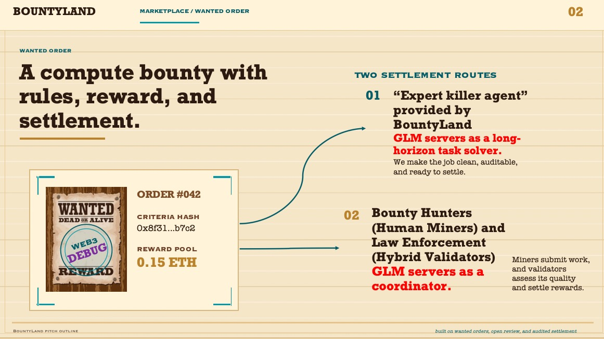
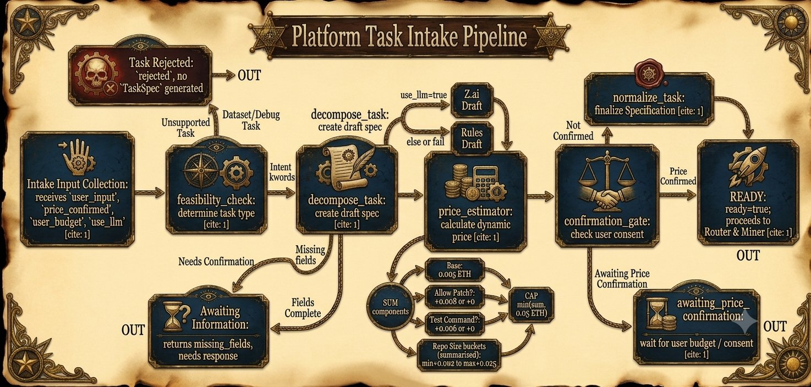
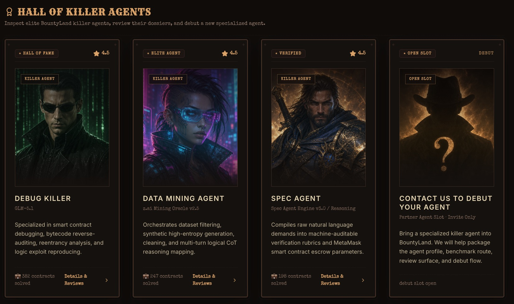
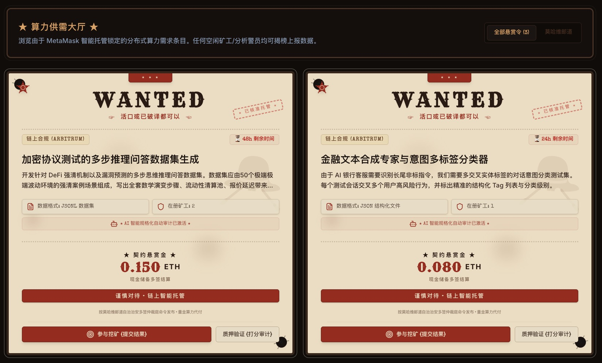

# Bounty Land

Web3 long-horizon task agents and bounty settlement platform.


Bounty Land 把“通缉令式悬赏”做成一个 Web3 长程任务平台：用户发布计算任务，平台 Agent 可以直接执行，也可以把任务发布到人工 Miner 市场；Validator 负责评分与审查，最终由链上合约记录结果、报告 hash 和奖励分配。

这个项目不是一次性聊天 Demo，而是一个从 **需求输入 -> TaskSpec -> Agent/Miner 执行 -> artifact/trace/report -> Validator 评分 -> 链上结算** 的完整闭环。
## 项目演示视频链接

[Bounty Land Demo Video](https://x.com/y_gla64630/status/2066125934353436828?s=46)

## 一句话

用户把模糊任务交给 Bounty Land，平台先用 Task Spec Agent 把任务变成可执行、可验证、可定价的规格；随后任务可以交给平台自营 Agent，也可以交给人工 Miner 市场；最后通过 Validator 与合约完成可追踪结算。

## 核心亮点

- **长程 Agent 后端**：基于 Python + LangGraph，实现任务受理、需求拆解、动态估价、路由、执行、trace 和 artifact 打包。
- **平台自营 Miner**：已实现 Dataset Miner 与 Debug Miner，支持 OSV 公开漏洞数据、GitHub 仓库调试、patch loop 和 Z.ai 调用统计。
- **人工 Miner 市场**：Human Market Task Spec Agent 帮用户 finalize 任务定义、Validator 评分细则和奖励规则 `x/y/z/[a1..ay]`。
- **链上结算层**：Solidity 合约负责 task、worker output、score、report hash、reward allocation 和 claim。
- **前端可演示闭环**：React/Vite 前端展示任务大厅、Agent Hall、Worker 提交、Validator 评分、链上状态和奖励分配。
- **支付与价格确认**：Agent 后端支持动态估价，前端确认价格后可使用 Sepolia tx hash 调用 `/v1/payment/verify` 验证付款。
- **黑客松叙事明确**：平台 Miner 像官方店，人工 Miner 像自由市场；用户既可以买平台能力，也可以发布悬赏让市场竞争。

## 产品流程



1. 用户输入自然语言任务。
2. Platform Task Intake Agent 判断任务类型、检查信息完整性、估价并等待价格确认。
3. 如果是平台任务，路由到 Dataset Miner 或 Debug Miner。
4. 如果是人工市场任务，Human Market Task Spec Agent finalize 任务规则、评分标准和奖励机制。
5. Miner 输出 artifact、trace 和 report。
6. Validator 根据评分细则评价结果。
7. Node API 记录任务状态，合约记录最终结果和奖励分配。

## 四个 Agent / Miner 流程

### 1. Platform Task Intake Agent

负责把用户自然语言需求转换为统一 `TaskSpec`，并完成任务支持判断、缺失字段检查、动态估价、价格确认和路由。



### 2. Dataset Miner

负责构建数据集。当前支持 OSV Public API 真实漏洞数据，也支持 Z.ai synthetic 记录和离线模板兜底。


### 3. Debug Miner

负责公开 GitHub 仓库调试。它会 clone 仓库、扫描上下文、运行用户确认的复现命令、分析失败信号、定位候选文件，并在 `allow_patch=true` 时进入最多 10 轮 patch loop。


### 4. Human Market Task Spec Agent

负责人工 Miner 市场订单草案。它和用户 finalize 任务定义、Validator 评分细则，以及奖励规则：

- `x`：threshold score，超过阈值才可能拿钱。
- `y`：最多获奖 Miner 数量。
- `z`：结算时间窗口。
- `[a1, a2, ..., ay]`：前 `y` 名分账比例，总和为 1。


## 系统架构

```text
React/Vite Frontend
  | 任务创建 / 钱包连接 / 价格确认 / 任务大厅 / 评分与结算展示
  v
Node API Backend
  | 任务市场状态 / Worker 提交 / Validator 评分 / 合约结算调用
  |                         \
  |                          \ 调用 Agent 后端
  v                           v
Solidity Contracts          Aurora Agent Core
Sepolia Testnet             Python + LangGraph + FastAPI
  |                          |
  | task / score / payout    | TaskSpec / Dataset / Debug / Human Market
  v                          v
Reward Settlement           artifacts / trace.json / report.md / patch.diff
```

这里有三个“后端”概念：

- **Node API 后端**：任务市场后端，负责前端任务、提交、评分、结算接口。
- **Agent 后端**：`aurora-agent-core`，负责 LangGraph Agent 和 Miner 执行。
- **链上合约后端**：Sepolia 合约，负责资金、结果记录和奖励领取。

## 仓库结构

```text
apps/api
  Node API 后端。负责任务状态、Worker 提交、Validator 评分和合约结算 dry-run/execute。

apps/compute-outsourcing-platform
  React + Vite 前端。展示 Bounty Land 产品界面、Agent Hall、任务大厅、Worker/Validator 流程。

aurora-agent-core
  Python + LangGraph Agent 后端。包含 Platform Task Intake、Dataset Miner、Debug Miner、
  Human Market Task Spec Agent、Z.ai 接入、支付验证和 artifacts。

contracts
  Solidity 合约。实现任务托管、Worker/Validator 注册、结果记录、声誉和奖励分配。

packages/shared
  前后端共享的评分模板、合约 ABI 和部署配置。

demo-bug-repo
  Debug Miner 演示用的小型问题仓库。

img
  产品截图和演示图。
```

## 快速开始

### 1. 安装根目录 Node 依赖

```bash
npm install
```

### 2. 配置根目录 `.env`

```bash
cp .env.example .env
```

常用字段：

```env
SEPOLIA_RPC_URL=https://...
SEPOLIA_PRIVATE_KEY=0x...
RESULT_ORACLE_ADDRESS=0x...
RESULT_ORACLE_PRIVATE_KEY=0x...
MIN_WORKER_STAKE_WEI=1000000000000000
MIN_VALIDATOR_STAKE_WEI=5000000000000000
```

`RESULT_ORACLE_PRIVATE_KEY` 推导出的地址必须等于合约中的 `resultOracle()`。

### 3. 启动 Node API 后端

```bash
npm run dev:api
```

默认地址：

```text
http://localhost:8787
```

健康检查：

```text
GET http://localhost:8787/health
```

### 4. 启动前端

```bash
npm run dev:fancy
```

默认地址：

```text
http://localhost:3000
```

### 5. 启动 Agent 后端

```bash
cd aurora-agent-core
conda env create -f environment.yml
conda activate aurora-agent-core
cp .env.example .env
```

在 `aurora-agent-core/.env` 中配置 Z.ai 和支付验证：

```env
ZAI_API_KEY=你的_zai_key
AURORA_MODEL=glm-5.1
AURORA_BASE_URL=https://api.z.ai/api/coding/paas/v4

SEPOLIA_RPC_URL=https://sepolia.infura.io/v3/YOUR_KEY
COMPUTE_PLATFORM_CONTRACT_ADDRESS=0x...
AURORA_PAYMENT_CHAIN_ID=11155111
```

启动：

```bash
python -m aurora_agent_core.api
```

默认地址：

```text
http://127.0.0.1:8791
```

## 常用接口

### Node API 后端

```text
GET  /health
POST /tasks/criteria
POST /tasks
GET  /tasks
GET  /tasks/:id
POST /tasks/:id/submissions
POST /tasks/:id/evaluations
POST /tasks/:id/settle
GET  /tasks/:id/settlements
```

### Agent 后端

```text
GET  /health
POST /v1/intake
POST /v1/execute
POST /v1/payment/verify
GET  /v1/artifacts/download
POST /v1/human-market/spec
POST /v1/platform-agents
GET  /v1/platform-agents
GET  /v1/platform-agents/{agent_id}
```

## Agent 调用示例

### Intake：只拆解和估价

```bash
curl -s http://127.0.0.1:8791/v1/intake \
  -H "Content-Type: application/json" \
  -d '{
    "user_input":"帮我修复公开 GitHub 仓库 https://github.com/octocat/Hello-World，测试命令: ls，修复代码，保留仓库",
    "use_llm":true
  }'
```

典型返回：

```text
status = awaiting_price_confirmation | ready | rejected
suggested_price = 动态估价
task_spec = 结构化任务
```

### Dataset Miner：执行数据集任务

```bash
curl -s http://127.0.0.1:8791/v1/execute \
  -H "Content-Type: application/json" \
  -d '{
    "user_input":"确认，帮我构建 10 条 Web3 漏洞数据集，仅公开来源，输出 jsonl，来源包括 OSV，npm:@openzeppelin/contracts",
    "price_confirmed":true,
    "use_llm":true
  }'
```

输出 artifact：

```text
dataset.jsonl 或 dataset.csv
sources.json
stats.json
report.md
trace.json
result.json
```

### Debug Miner：执行公开仓库 Debug

```bash
curl -s http://127.0.0.1:8791/v1/execute \
  -H "Content-Type: application/json" \
  -d '{
    "user_input":"帮我修复公开 GitHub 仓库 https://github.com/octocat/Hello-World\n测试命令: ls\n请修复，保留仓库，我要看修改后的代码\ntimeout:120",
    "price_confirmed":true,
    "use_llm":true
  }'
```

判断是否进入 patch loop：

```text
execution.usage.patch_iterations > 0
execution.debug.patch_iterations 非空
execution.summary.patch_generated = true
execution.usage.llm.total_tokens 记录 Z.ai 消耗
```

输出 artifact：

```text
debug_report.md
runtime.json
repo_context.json
trace.json
result.json
patch.diff              # 有补丁时生成
workspace/repo          # allow_patch=true 时保留修改后代码
```

### Human Market Task Spec Agent

```bash
curl -s http://127.0.0.1:8791/v1/human-market/spec \
  -H "Content-Type: application/json" \
  -d '{
    "user_input":"发布人工 debug 悬赏：修复 GitHub 仓库测试失败，交付 patch 和验证报告。validator 按测试通过、补丁安全性、说明质量评分。threshold 80，前 3 名按 [0.5,0.3,0.2] 分钱，窗口 7 天。",
    "use_llm":true
  }'
```

该接口只 finalize 人工市场订单规则，不执行 Dataset/Debug Miner。前端可以把最终 JSON 转成 `taskURI/orderURI/criteriaHash`，再走链上创建任务。

### Payment Verify：验证 Sepolia tx hash

前端钱包付款后，把交易哈希交给 Agent 后端验证：

```bash
curl -s http://127.0.0.1:8791/v1/payment/verify \
  -H "Content-Type: application/json" \
  -d '{
    "tx_hash":"0x...",
    "expected_price":0.024,
    "payer_address":"0x..."
  }'
```

验证通过后再调用 `/v1/execute`，并传：

```json
{
  "price_confirmed": true,
  "payment_tx_hash": "0x...",
  "payment_expected_price": 0.024
}
```

## 前端演示路径



1. 进入 Agent Hall，查看平台自营 killer agents。
2. 创建任务，选择平台 Agent 或人工市场。
3. Platform Task Intake Agent 返回估价，前端展示价格确认。
4. 用户钱包付款，前端拿到 `txHash`。
5. Agent 后端验证付款，执行 Dataset/Debug Miner。
6. 前端展示 report、trace、patch、修改后 repo 或数据集 artifact。



人工市场路径：

1. Human Market Task Spec Agent 生成任务草案。
2. 用户确认评分细则和奖励规则。
3. 任务进入大厅。
4. 人工 Miner 接单并提交结果。
5. Validator 评分。
6. Node API 和合约完成结算记录。

## 合约

核心合约：

```text
contracts/src/ComputeOutsourcePlatform.sol
```

主要能力：

```text
createTask
fundTask
registerWorker / registerValidator
submitWorkerOutput
submitResult
finalizeTask
claimReward
```

合约不运行 AI，也不解析报告。Agent 和 Validator 在链下生成结论，链上只记录可验证字段：

```text
taskURI
outputURI
outputHash
workerScore
validatorScore
reportURI
reportHash
reward allocation
```

命令：

```bash
npm run contracts:compile
npm run contracts:test
npm run contracts:deploy:sepolia
```

部署脚本会生成：

```text
contracts/deployments/sepolia.json
packages/shared/src/contracts/compute-platform-sepolia.json
```

## 测试

根目录 Node / 合约检查：

```bash
npm run check
npm run contracts:test
```

Agent 后端测试：

```bash
cd aurora-agent-core
pytest -q
```

前端构建：

```bash
npm --prefix apps/compute-outsourcing-platform run build
```

## 当前状态

已完成：

- React/Vite Bounty Land 前端。
- Node API 任务、提交、评价、结算 dry-run/execute。
- Sepolia 合约与 shared ABI 配置。
- Aurora Agent Core FastAPI。
- Platform Task Intake Agent。
- Dataset Miner。
- Debug Miner patch loop。
- Human Market Task Spec Agent。
- Z.ai GLM-5.1 接入和 token usage 统计。
- Sepolia payment tx hash 验证。
- Agent artifacts、trace 和 report 输出。

待完善：

- 前端把支付确认、tx hash 验证和 `/v1/execute` 串成更顺滑的状态机。
- Debug Miner 对大型仓库的进度流式返回。
- Artifact 下载、预览和 zip 打包在前端统一展示。
- 人工 Miner 市场的链上 taskURI/criteriaHash 发布流程。
- Validator 自动评分与人工评分混合机制。
- Cobo Agentic Wallet / Safe 作为预算钱包和结算权限层。
- 更细粒度的模型成本估算与用户预算上限控制。

## 安全边界

当前版本是黑客松 MVP，不是生产级托管系统。

- Debug Miner 只建议运行可信公开 demo repo。
- 运行命令必须由用户明确提供或确认。
- 私钥只能放在根目录 `.env` 或安全密钥管理服务，不能进入前端环境变量。
- 前端不接触 result oracle 私钥。
- Agent 输出报告和评分，合约只记录 hash、score 和结算结果。
- Cobo CAW / Safe / 多签可以作为后续资金权限层接入，但不是当前核心依赖。

## License

Hackathon prototype. For demonstration and research use.
