# Aurora Agent Flow Diagrams

本文只画当前代码中已经实现的逻辑。当前已实现平台自营 Dataset/Debug Agent、人工市场 Task Spec Agent、平台 Agent 注册接口、Sepolia txHash 支付验证；不包含人工 Miner 接单执行市场本身。

代码入口：

- `TaskIntakeGraph`: `aurora_agent_core/agents/task_intake_graph.py`
- `DatasetMinerGraph`: `aurora_agent_core/miners/dataset_miner_graph.py`
- `DebugMinerGraph`: `aurora_agent_core/miners/debug_miner_graph.py`
- `HumanMarketTaskSpecGraph`: `aurora_agent_core/agents/human_market_task_spec_graph.py`
- `Payment Verification`: `aurora_agent_core/payment.py`
- `Platform Agent Registry`: `aurora_agent_core/platform_agent_registry.py`

## 1. Platform Task Intake Agent

对应接口：

```text
POST /v1/intake
POST /v1/execute
POST /v1/payment/verify
```

真实 LangGraph 节点：

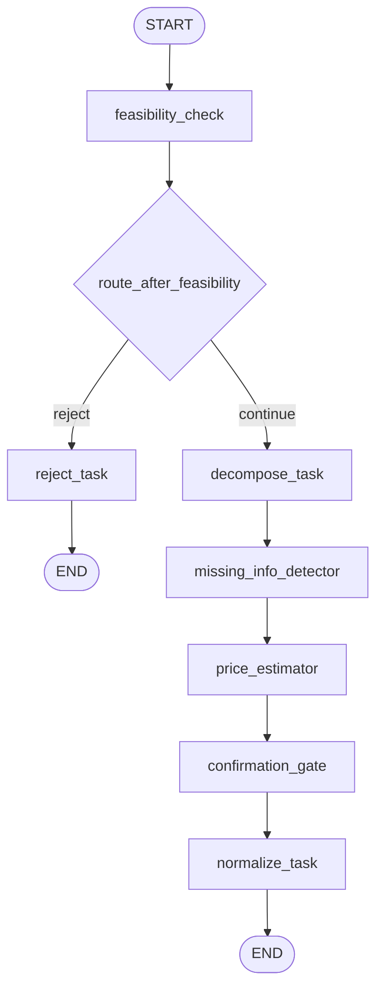

节点含义：

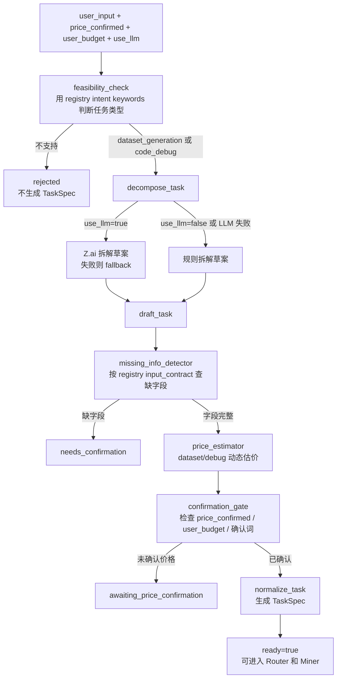

Debug 动态估价：

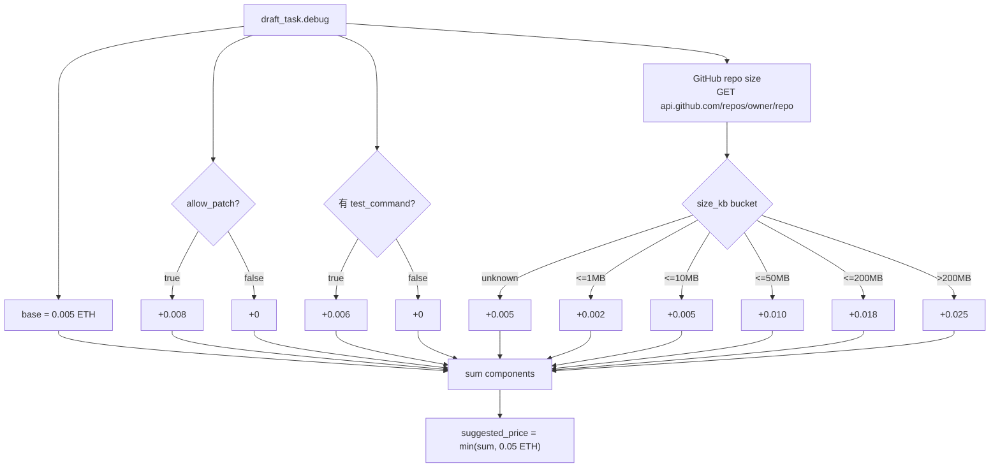

平台执行链路：

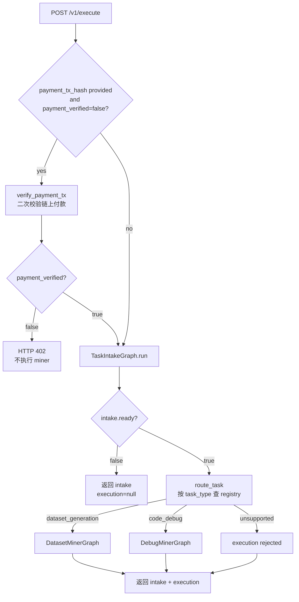

## 2. Dataset Miner Agent

对应执行入口：

```text
TaskSpec.task_type = dataset_generation
```

真实 LangGraph 节点：

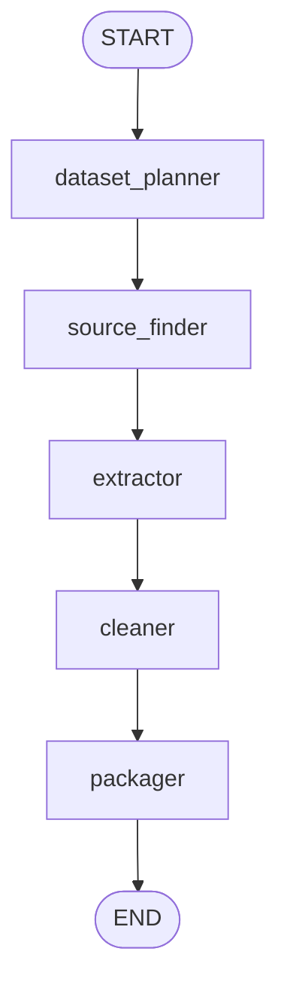

当前已实现逻辑：

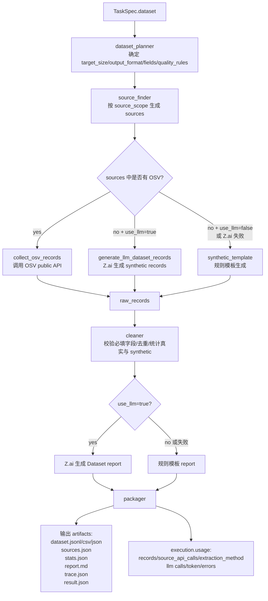

关键点：

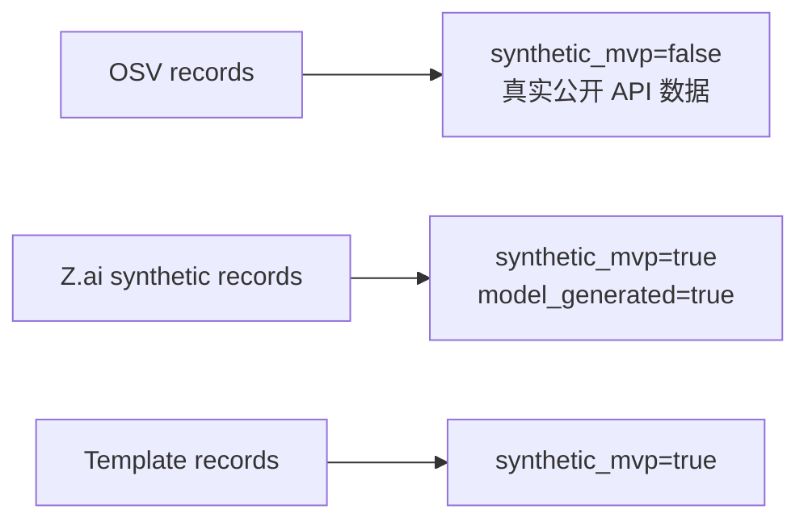

## 3. Debug Miner Agent

对应执行入口：

```text
TaskSpec.task_type = code_debug
```

真实 LangGraph 节点：

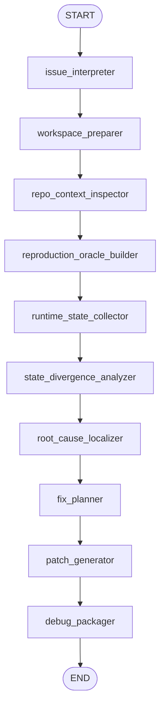

当前已实现逻辑：

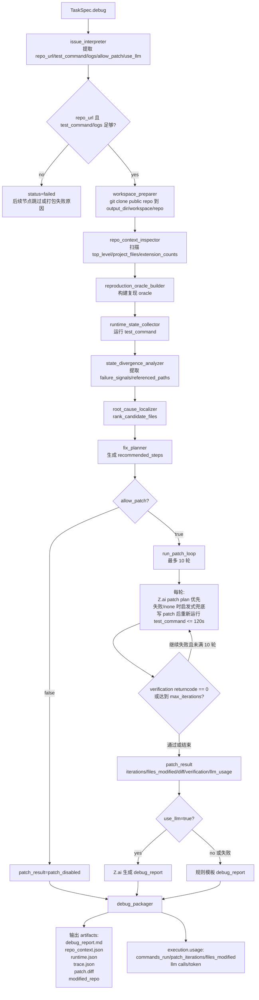

Debug patch loop 真实策略：

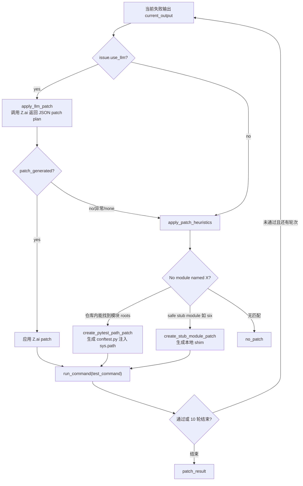

## 4. Human Market Task Spec Agent

对应接口：

```text
POST /v1/human-market/spec
```

这个 agent 不执行平台 Dataset/Debug Miner。它只负责人工 Miner 市场的任务条款草案和最终确认。

真实 LangGraph 节点：

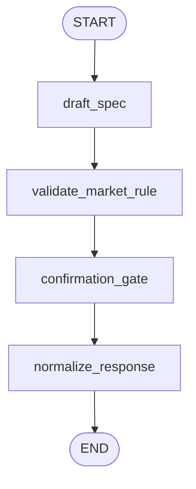

当前已实现逻辑：

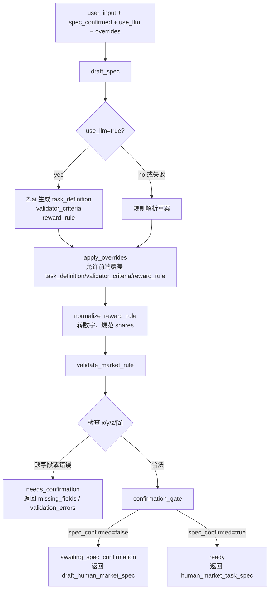

奖励规则校验：

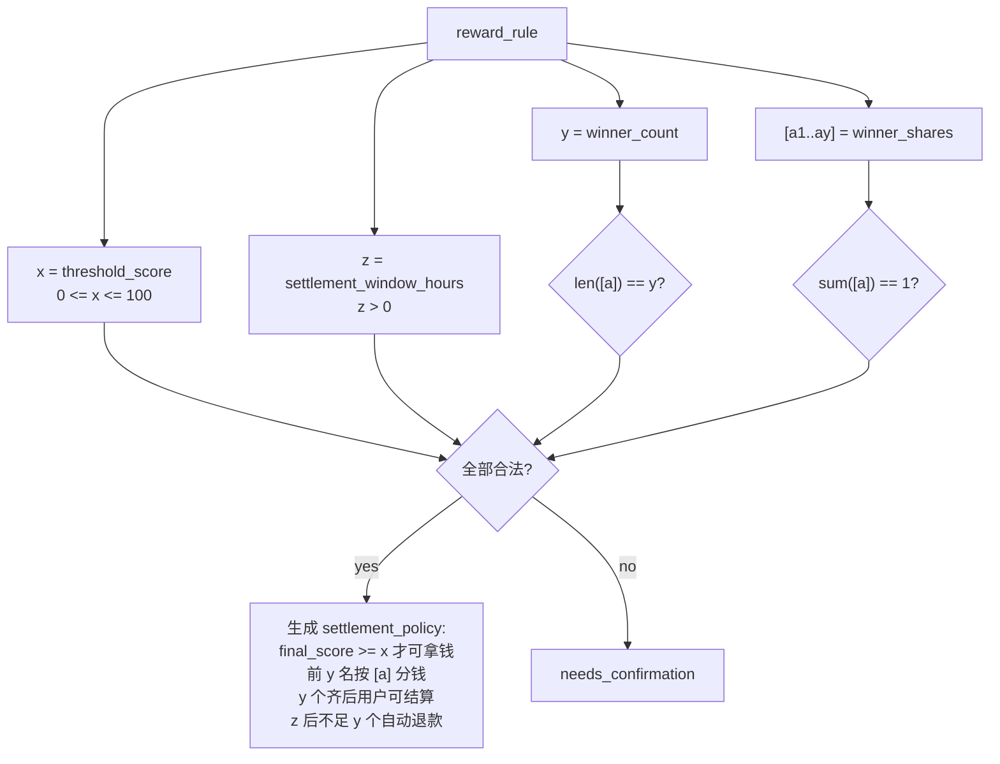

## 5. Payment Verification Module

对应接口：

```text
POST /v1/payment/verify
```

这不是 LangGraph agent，而是 Agent 后端的支付闸门。前端钱包付款后，把 `tx_hash` 发给这里；验证通过后才继续执行平台 Dataset/Debug Miner。

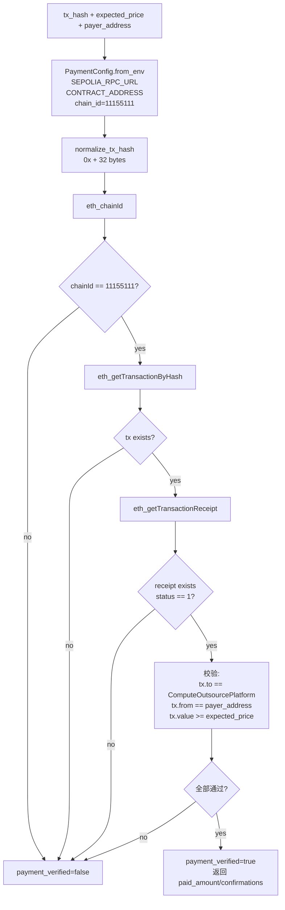

前端推荐链路：

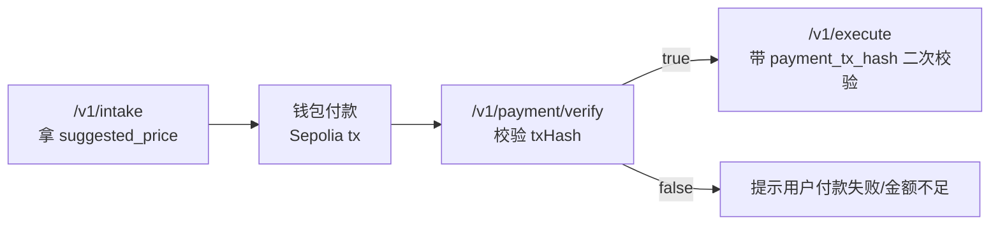

## 6. Platform Agent Registry

对应接口：

```text
POST /v1/platform-agents
GET /v1/platform-agents
GET /v1/platform-agents/{agent_id}
```

这不是 LangGraph agent，而是“新增平台 miner/agent”的注册入口。目前是内存存储，服务重启后会丢。

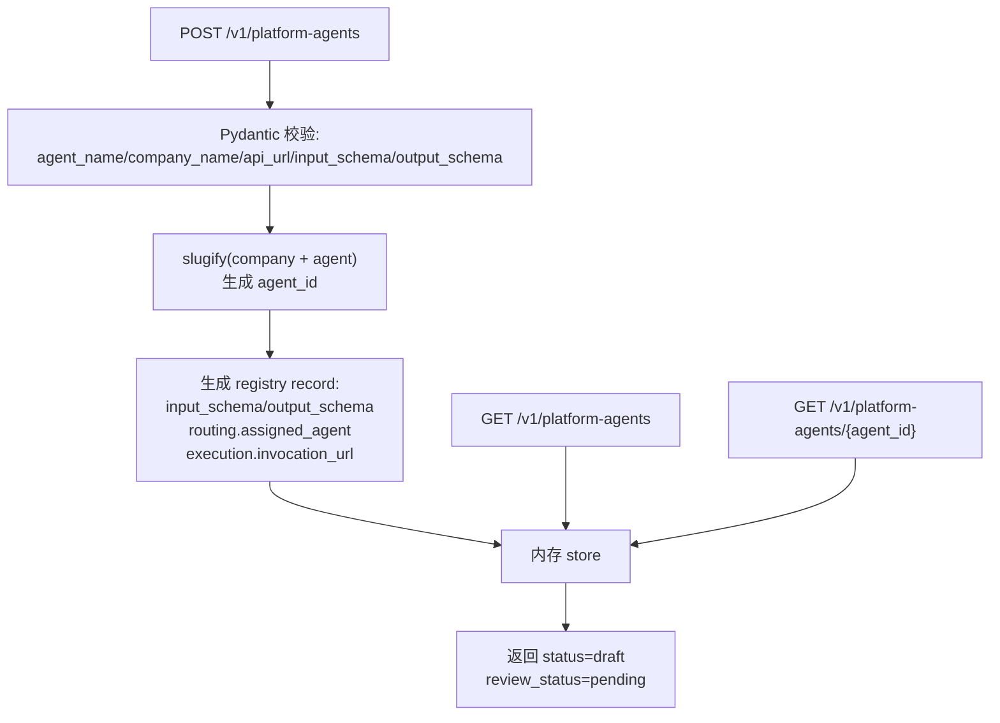

## 对外讲法

如果只讲三个核心模块，建议这样讲：

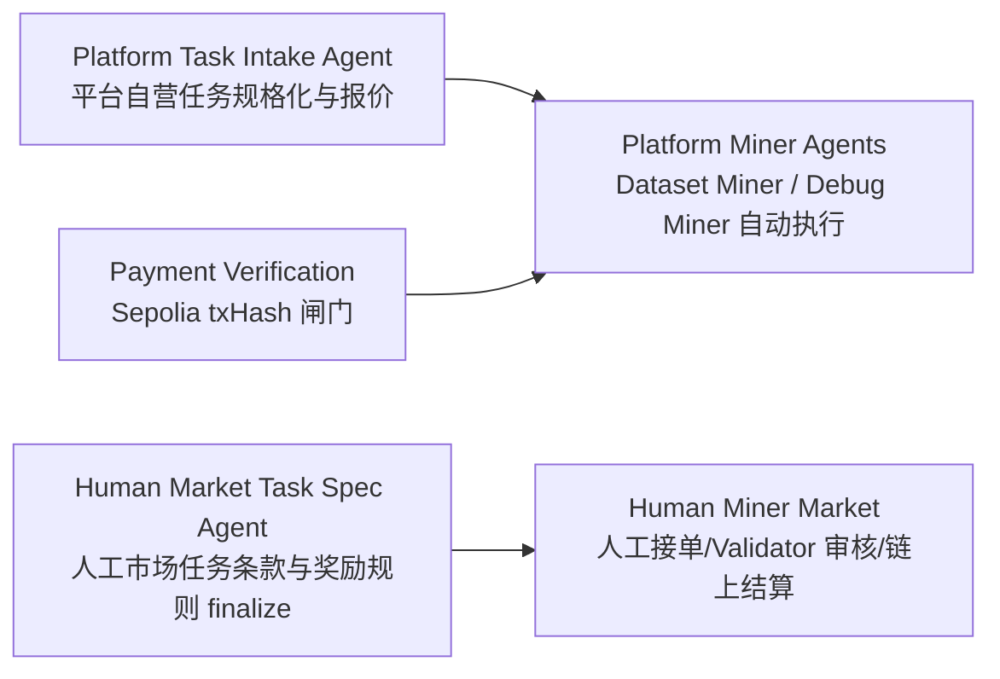

当前代码已实现：

```text
Platform Task Intake Agent: 已实现
Dataset Miner Agent: 已实现
Debug Miner Agent: 已实现
Human Market Task Spec Agent: 已实现
Payment Verification: 已实现
Platform Agent Registry: 已实现
Human Miner Market 接单执行和 Validator 市场页面: 不在 aurora-agent-core 内
```
